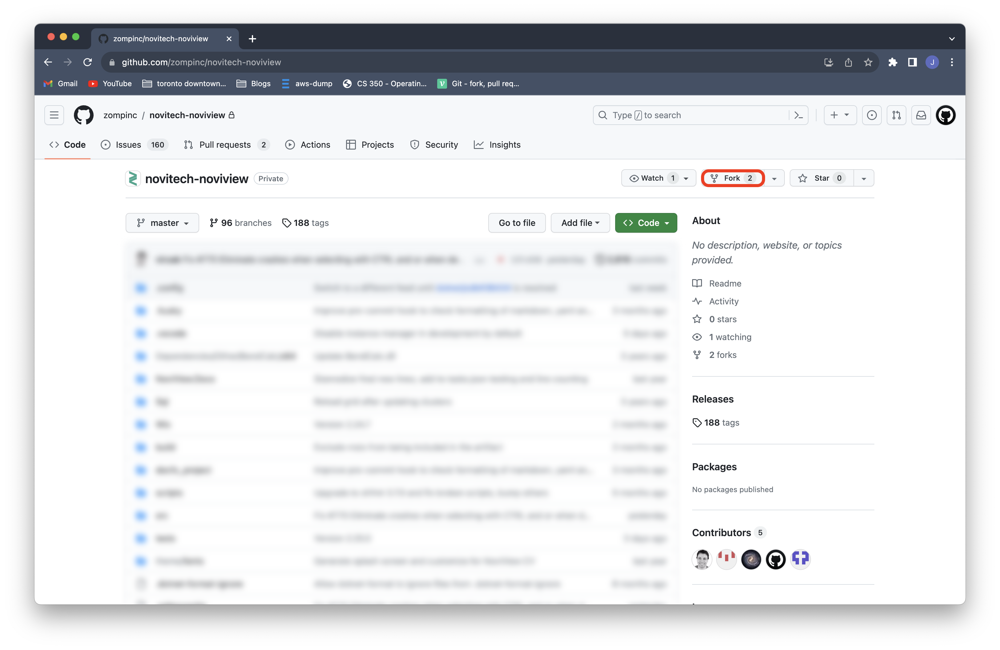
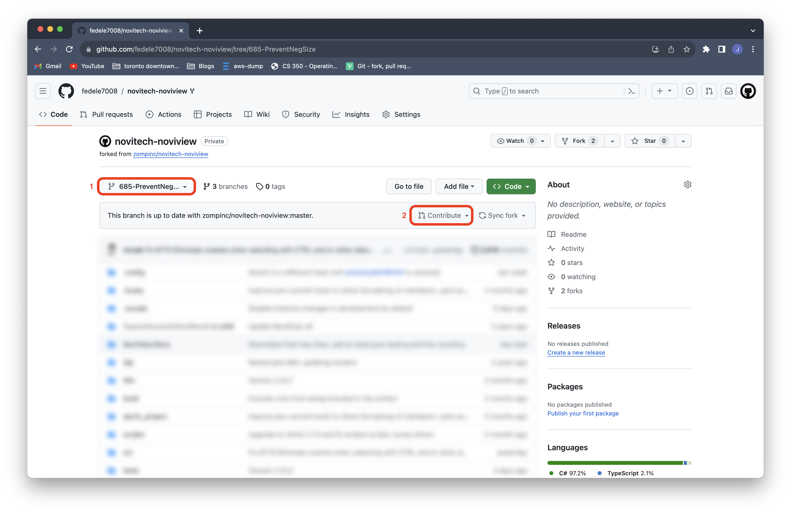

# How to contribute to the GitHub project

## Contents

* [Introduction](#introduction)
* [Fork Repository](#fork-repository)
* [Creating a new working branch](#creating-a-new-working-branch)
* [Submitting from the working branch](#submitting-code-from-the-working-branch)
* [Update the Codebase while working on the working branch](#update-the-codebase-while-working-on-the-working-branch)
* [Create pull request](#creating-pull-request)
* [Synchronizing repository after pull request gets merged](#synchronizing-repository-after-pull-request-gets-merged)
* [Example](#example)

## Introduction

There are various ways to contribute to Github projects.

* You may clone the repository, make changes, and push directly to the main branch.

    But if you are working with other people, this is not recommended and should be avoided.

* You may also create a new branch in the repo, make changes there and then create the pull request for that branch.

    This is a good practice, but you may have to configure some privilege issues in the Github repo for pushing branches to remote. (Especially if you are contributing to some open source project)

* Finally, we can fork the repository and create a pull request from changes made in that forked repository. This is a highly recommended practice for collaboration. (In open source project, this is a must)

Note that the naming of the primary branch may vary depending on the project.
The traditional naming convention was `master` however, people tend to use `main` instead as the "master" resembles slavery.

Some may use different naming conventions like `develop`, `core`, etc.

In this documentation, we will learn the third approach using a fork.

## Fork repository

1. Goto the GitHub repository you want to work on and Fork the repo by clicking the `Fork` button. Now, you should have the new forked repository under your account.

    

1. Clone the **forked repository** into your local machine.

    ```git
    git clone ≪Forked Repository≫
    ```

    * You can run `git remote -v` to check remote repositories for the current repository.

        The `origin` should be reserved for the currently **forked repository**.

1. Set up the upstream for the forked repository.

    ```git
    # git remote add ≪alias≫ ≪Upstream Repository≫
    ```

    * The `≪alias≫` is typically named "upstream." We will use `upstream` as our upstream repository alias in this document.

## Creating a new working branch

1. Goto the root folder where you cloned the **forked repository** in your terminal.

1. Check out the primary branch that you are going to start from.

    ```git
    git checkout ≪Primary Branch≫
    ```

1. Fetch any updates from the upstream repository.

    ```git
    git fetch upstream
    ```

1. Rebase primary branch up-to-date.

    ```git
    git rebase upstream/≪Primary Branch≫
    ```

1. Push the up-to-date branch to the remote repository.

    ```git
    git push origin ≪Primary Branch≫
    ```

1. Create a new working branch

    ```git
    git checkout -b ≪Working Branch≫
    ```

* You can check the branches on **local machine** using `git branch`
* You can check all branches on both **local** and **remote** machine using `git branch -a`
* If you want to remove some branch from the **local machine**, use `git branch -d ≪Branch Name≫`
* If you want to force-delete some branch from the **local machine**, use `git branch -D ≪Branch Name≫`
* If you want to remove some branch from the **remote repository**, use `git push ≪Remote≫ --delete ≪Branch Name≫`
* If you removed some branch from the **remote repository** and want to update that fact to the local machine, use `git fetch --prune`.

    You still have to run `git branch -D ≪Branch Name≫` to remove the branch entirely from the local machine, too.

## Submitting code from the working branch

1. After writing code on your working branch, add the files with changes to the commit list.

    ```git
    git add ≪File names≫
    ```

    * `*` or `.` for the `≪File names≫` implies all files that have been changed will be added.

        This excludes the files that are enlisted in the `.gitignore` file.

1. Commit the work

    ```git
    git commit
    ```

    * You will see some file editor after `git commit`, write some commit messages and **save & exit** the file editor to finish the commit. If you **discard changes & quit**, the commit will be discarded.
        * If you use `vim` editor, `:wq` to **save & exit**, or use `:q!` to **discard changes & quit**.

    * You can also use `git commit -m ≪Some commit message≫` to write a simple commit message. (Only recommended for minor changes)

1. Push all local commits to the remote repository

    ```git
    git push origin ≪Working Branch≫
    ```

## Update the codebase while working on the working branch

Sometimes, you can update the codebase while working on the working branch.

1. Fetch changes from the upstream repository

    ```git
    git fetch upstream
    ```

1. Goto primary branch

    ```git
    git checkout ≪Primary Branch≫
    ```

1. Rebase primary branch up-to-date.

    ```git
    git rebase upstream/≪Primary Branch≫
    ```

1. Push changes to the remote repository

    ```git
    git push origin ≪Primary Branch≫
    ```

1. Goto working branch

    ```git
    git checkout ≪Working Branch≫
    ```

1. Rebase working branch up-to-date.

    ```git
    git rebase ≪Primary Branch≫
    ```

1. Push the changes to the remote repository

    ```git
    git push -f origin ≪Working Branch≫
    ```

## Creating Pull Request

1. Goto your forked repository from Github.

1. Select your **working branch** and click on **Contribute** button.

    

1. Click the **Open pull request** button, describe the issue and leave comments about your pull request.

1. Press **Create pull request** button.

## Synchronizing repository after pull request gets merged

After your pull request has been merged, you must update your forked repository to apply the changes made.

1. Fetch changes from the upstream repository

    ```git
    git fetch upstream
    ```

1. Goto primary branch

    ```git
    git checkout ≪Primary Branch≫
    ```

1. Rebase primary branch up-to-date.

    ```git
    git rebase upstream/≪Primary Branch≫
    ```

1. Push the changes to the upstream repository

    ```git
    git push origin ≪Primary Branch≫
    ```

1. Remove the local working branch

    ```git
    git branch -D ≪Working Branch≫
    ```

1. Remove the working branch from the forked repository

    ```git
    git push origin --delete ≪Working Branch≫
    ```

## Example

Here is an example of the workflow that you will be using.

Assume that your upstream repository uses the **master** branch as the primary branch (as well as your forked repository), and you will be working on a branch named **some-issue**.

1. Fork the repository

    ```git
    git clone ≪Forked Repository≫
    ```

1. Set up the upstream for the forked repository.

    ```git
    git remote add upstream ≪Upstream Repository≫
    ```

1. Update the codebase if your master branch is outdated

    ```git
    git fetch upstream
    git checkout master
    git rebase upstream/master
    git push origin master
    ```

1. Create your working branch

    ```git
    git checkout -b some-issue
    ```

1. Update your codebase from upstream (if necessary)

    ```git
    git fetch upstream
    git checkout master
    git rebase upstream/master
    git push origin master
    git checkout some-issue
    git rebase master
    git push -f origin some-issue
    ```

1. Make any changes to the working branch and commit

    ```git
    git add *
    git commit -m "≪Some commit message≫"
    git push origin some-issue
    ```

    Create a Pull Request if you haven't already.

    Your pull request should be from your **forked some-issue** branch to the **upstream master** branch.

1. Repeat step **5** until your work is done.

    Updating the code once in a while is recommended.

1. After Your pull request has been approved and merged, delete the working branch and update your forked repository's master branch

    ```git
    git fetch upstream
    git checkout master
    git rebase upstream/master
    git push origin master
    git branch -D some-issue
    git push origin --delete some-issue
    ```

1. Repeat from step **3** if you get assigned to another issue
